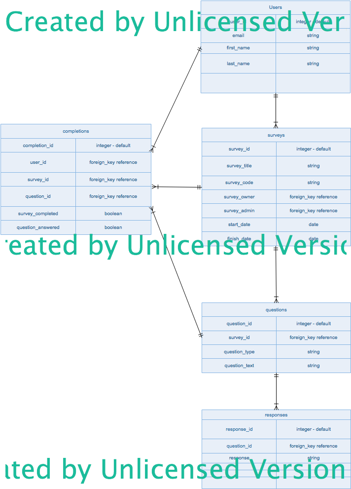

# WDI Project 4 - Chris Perry
----
#### Created: 17 February 2017 09:45
#### Last Updated: 18 February 2017 13:46
----

## Project Summary:
The basic premise of the project is to create an user-friendly online survey tool, that also provides comprehensive tools to allow those running a survey to understand what both the response metrics and any 'narrative' context provided by users, are telling them.

## Key Features

- Simple end-user interface
- Anonymity for respondant's responses
- Graphical representation of results (including over time)
- Graphical representation of response rates
- Access to narrative responses
- Ability to select target audience on an 'all users' or individual basis
- Ability to create multiple question types
 - Text based
 - 1-5 single select (inc. n/a)
 - Binary select (yes/no)
 - **_Multi-select (inc. 'other' type for added context)_**

## Models
### Entity Relationship Diagram

_Created in Edraw Max on 30-day trial version_
### users
#### Fields:
- user_id - default
- email - string
- password_digest - string
- first_name - string
- last_name - string

#### Relationships:
- `has_many :completions`
- `has_many :surveys`

### surveys
#### Fields:
- survey_id - default
- survey\_title - string
- survey_code - string (randomly generated)
- survey\_owner (foreign\_key[users])
- survey\_admin (foreign\_key[users])
- start_date - date
- finish_date - date

#### Relationships:
- `belongs_to :user`
- `has_many :questions`
- `has_many :completions`

### questions
#### Fields:
- question_id - default
- survey_id (foreign\_key[surveys])
- question\_type - string
- question\_text - text (500 char limit)

#### Relationships:
- `belongs_to :survey`
- `has_many :responses`
- `has_many :completions`

### responses
#### Fields:
- response_id - default
- question_id (foreign\_key[questions])
- response_text - text (500 char limit)

#### Relationships:
- `belongs_to :question`

### completions
#### Fields:
- completion_id - default
- user_id (foreign\_key[users])
- survey_id (foreign\_key[surveys])
- question_id (foreign\_key[questions])
- survey_completed - boolean
- question_answered - boolean

#### Relationships:
- `belongs_to :user`
- `belongs_to :question`
- `belongs_to :survey`

## Back-end Tools/Libraries
- Postgres
- Rails (API)
- BCrypt
- Active_Model_Serialzers

## Front-end Tools/Libraries
- Angular
- Angular Chart
- CSS

